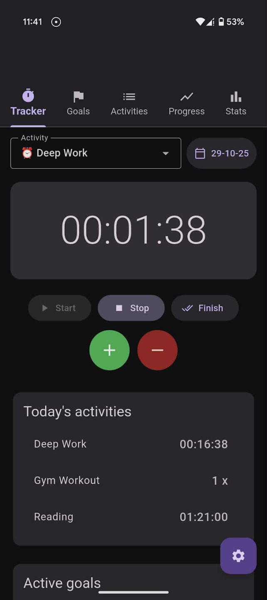
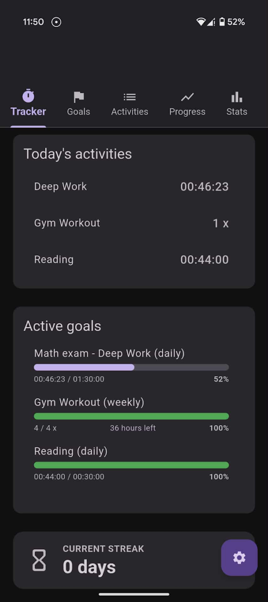
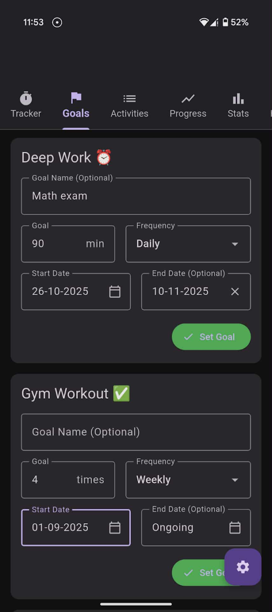
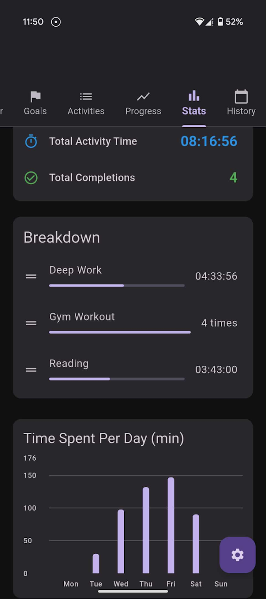
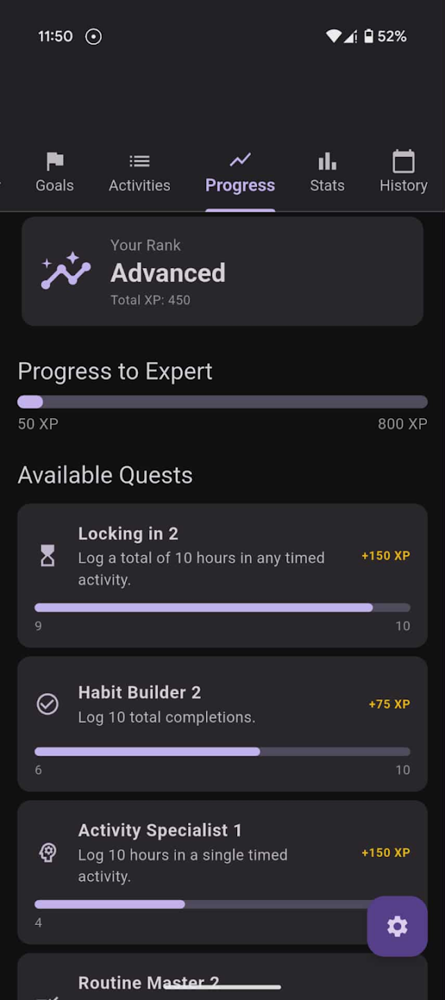
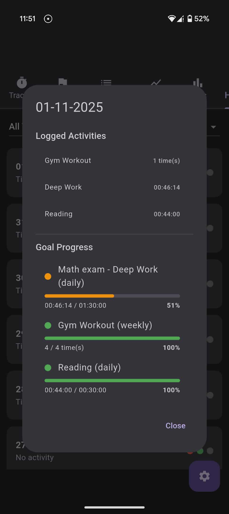

<div align="center">


# Lock In – Productivity Tracker

Track your focus time, build streaks, hit your goals.

[](https://play.google.com/store/apps/details?id=io.github.pedziwiatrr.lockin)


</div>

---

## Overview

**Lock In** is a Flutter productivity app for tracking time and habits. Run a live stopwatch for focus sessions (study, deep work) or log completion counts for checkable habits (gym, reading). Set daily / weekly / monthly goals, keep your streak alive, earn XP through quests, and review everything in rich statistics and history — all stored locally on the device. Live on Google Play.

---

## Screenshots

<table>
  <tr>
    <td></td>
    <td></td>
    <td></td>
  </tr>
  <tr>
    <td align="center"><b>Live timer</b></td>
    <td align="center"><b>Goals &amp; streak</b></td>
    <td align="center"><b>Goal setup</b></td>
  </tr>
  <tr>
    <td></td>
    <td></td>
    <td></td>
  </tr>
  <tr>
    <td align="center"><b>Statistics</b></td>
    <td align="center"><b>Quests &amp; ranks</b></td>
    <td align="center"><b>History</b></td>
  </tr>
</table>

---

## Features

- **Activity tracking** — a live stopwatch for timed activities, or completion counters for checkable habits, with manual +/− adjustments.
- **Background timer** — sessions keep counting with the screen off via a foreground service, showing a live-ticking notification (chronometer) with the current activity.
- **Per-session target** — optionally set a target time for a session and get a one-time alert when you reach it (the stopwatch keeps running — no auto-stop).
- **Goals** — daily, weekly, and monthly goals per activity, with optional names and start/end dates, plus optional goal reminders.
- **Statistics** — bar charts (`fl_chart`) for time and completions across day / week / month / all-time, a per-activity breakdown, streaks, and motivational stats.
- **Progress & gamification** — complete **Quests** to earn **XP** and climb through **Ranks**.
- **History** — browse past days with logged activities, goal progress, and editable per-day notes.
- **Backup & restore** — export all data to a JSON file and import it back.
- **Customization** — light / dark theme; manage up to 10 activities (add, rename, delete, reorder).
- **Local-first** — all data persisted on-device with `SharedPreferences`; no account required.

---

## Tech stack

- **Flutter / Dart** — single codebase, Android release on Google Play.
- **Storage** — `SharedPreferences` (JSON-serialized activities, logs, goals, notes).
- **Background execution** — `flutter_background_service` (foreground service + isolate) running a wall-clock timer that survives app suspension.
- **Notifications** — `flutter_local_notifications` + `timezone` for the live session notification, target alerts, and scheduled goal reminders.
- **Charts** — `fl_chart`.
- **Monetization** — `google_mobile_ads` (rewarded ads), with build-time test/production ad-unit selection.
- **Backup** — `share_plus`, `file_picker`, `path_provider` for JSON export/import.

---

## Project structure

```
lib/
├── main.dart                 # App entry + background-service isolate (timer tick)
├── models/
│   ├── activity.dart         # Activity (TimedActivity / CheckableActivity)
│   ├── goal.dart             # Goal (daily / weekly / monthly)
│   └── activity_log.dart     # ActivityLog entries
├── pages/
│   ├── home_page.dart        # Tab shell + core data layer
│   ├── tracker_page.dart     # Timer / counter UI
│   ├── goals_page.dart       # Create & edit goals
│   ├── activities_page.dart  # Manage activities
│   ├── progress_page.dart    # Quests, XP, ranks
│   ├── stats_page.dart       # Charts & breakdown
│   ├── history_page.dart     # Daily history + notes
│   └── settings_page.dart    # Theme, backup/restore, preferences
└── utils/
    ├── ad_manager.dart           # AdMob management
    ├── notification_service.dart # Local notifications & channels
    └── format_utils.dart         # Time formatting (HH:mm:ss)
vendor/
└── flutter_background_service_android/  # Vendored plugin (wake-lock fixes)
```

---

## Build & run

Requires the Flutter SDK (latest stable).

```bash
git clone https://github.com/Pedziwiatrr/Lock-In-app
cd Lock-In-app
flutter pub get
flutter run
```

Release build (Android App Bundle):

```bash
flutter build appbundle --release
```

> Release signing reads from `android/key.properties` (git-ignored). Without it, the build falls back to debug signing.
